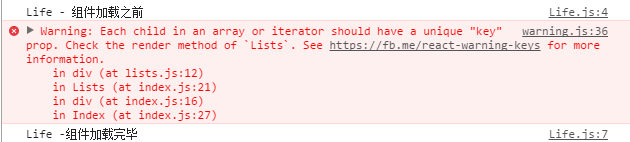

#　列表渲染　　　　

##　渲染存放 JSX 元素的数组　　
一般我们都会使用map方法来进行列表渲染  

```
import React from 'react';
const users = [
  { username: 'Jerry', age: 21, gender: 'male' },
  { username: 'Tomy', age: 22, gender: 'male' },
  { username: 'Lily', age: 19, gender: 'female' },
  { username: 'Lucy', age: 20, gender: 'female' }
];

class Lists extends React.Component{
    render() {
        let userList = users.map((val,key) => (<div>
            <span>name:{val.username}</span>
            <span>age:{val.age}</span>
            <span>gender:{val.gender}</span>
        </div>));
        return (
            <div>
                {userList}
            </div>
        );
    }
}
export default Lists;
```  
但是你会发现,这样有报错信息!    

  

## key!key!key!  

React.js 的是非常高效的，它高效依赖于所谓的 Virtual-DOM 策略。简单来说，能复用的话 React.js 就会尽量复用，没有必要的话绝对不碰 DOM。对于列表元素来说也是这样，但是处理列表元素的复用性会有一个问题：元素可能会在一个列表中改变位置。  

**对于用表达式套数组罗列到页面上的元素，都要为每个元素加上 key 属性，这个 key 必须是每个元素唯一的标识。一般来说，key 的值可以直接后台数据返回的 id，因为后台的 id 都是唯一的。**  

```
import React from 'react';

const users = [
  { username: 'Jerry', age: 21, gender: 'male' },
  { username: 'Tomy', age: 22, gender: 'male' },
  { username: 'Lily', age: 19, gender: 'female' },
  { username: 'Lucy', age: 20, gender: 'female' }
];
class Item extends React.Component{
    componentWillMount(){
        console.log(this)
    }
    render() {
        console.log(this.props)
        const {user} = this.props;
        return(
            <div>
                <span>{user.username}</span>
                <span>{user.age}</span>
                <span>{user.gender}</span>
            </div>
        )
    }
}

class Lists extends React.Component{
    render() {
        let userList = users.map((val,key) =><Item key={key} user={val} />);
        return (
            <div>
                {userList}
            </div>
        );
    }
}
export default Lists;
```