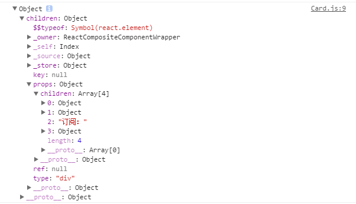

# props.children  和组件类容器  
假设我们现在定义了一个card容器,这个容器只是一个外层结构的形式,我们需要让里面填充不同的内容.  
```
import React from 'react';

class Card extends  React.Component {
    render() {
        return(
            <div className="card">
                {this.props.content}
            </div>
        );
    }
}

export default Card;  
<Card content={
    <div>
        <h2>React.js 小书</h2>
        <div>开源、免费、专业、简单</div>
        订阅：<input />
    </div>
}/>
```  
但是这样明显过于丑陋,我们希望这样传递数据
```
<Card>
    <h2>React.js 小书</h2>
    <div>开源、免费、专业、简单</div>
    订阅：<input />
</Card>
```
那么我们可以这么写  

```
class Card extends  React.Component {
    render() {
        console.log(this.props);
        return(
            <div className="card">
                {this.props.children}
            </div>
        );
    }
}

export default Card;
```

通过console我们可以看出,`this.props.children`其实是一个数组    

  

React.js 就是把我们嵌套的 `JSX` 元素一个个都放到数组当中，然后通过 `props.children` 传给了 Card。  

由于 JSX 会把插入表达式里面数组中的 `JSX` 一个个罗列下来显示。所以其实就相当于在 Card 中嵌套了什么 `JSX` 结构，都会显示在 Card 的类名为 card-content 的 div 元素当中   
 


使用自定义组件的时候，可以在其中嵌套 JSX 结构。嵌套的结构在组件内部都可以通过 props.children 获取到，这种组件编写方式在编写容器类型的组件当中非常有用。而在实际的 React.js 项目当中，我们几乎每天都需要用这种方式来编写组件。  
 


